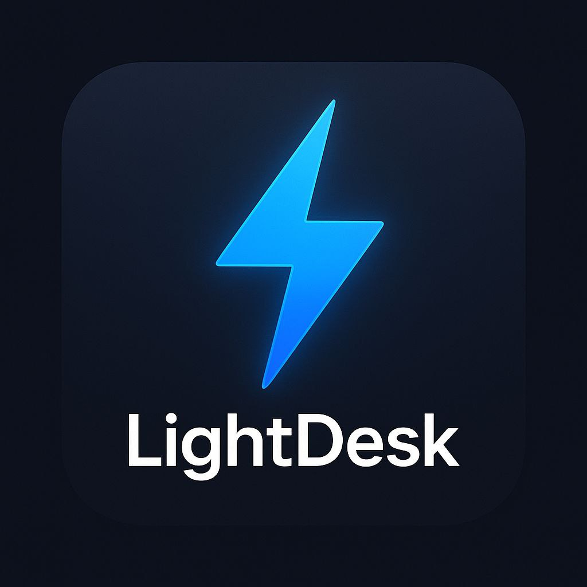

## LightDesk
A lightweight desktop hub for **optimization, monitoring, and screen recording** - build for low-end PCs.
Minimal dependencies, offline support, and a simple, modern interface.

## Features (MVP)
- Safe system cleanup (trmp, cache, browser data)
- Real-time CPU / RAM monitor
- Network tools: ping test, speed test (via 'speedtest-cli')
- Screen recording through 'ffmpeg'
- Smart Advisor: bitrate / FPS recommendations based on your setup

## Quick Start
'''bash
# 1) Requires Python 3.8+ (Tkinter is bundled)
pip install -r requirements.txt

# 2) Make sure ffmpeg is in your PATH (or set a custom path)
python src/main.py
